# 🏥 Medical Service Web Application

## 4.1.1 Title
**Medical Service Web Application**

---

## 4.2.2 Description
This use case outlines the process flow for utilizing a medical service web application, including patient registration, appointment scheduling, and medical service provision. The application facilitates seamless interactions among administrators, healthcare providers, and patients, enabling patients to book appointments and receive medical services.

---

## 4.2.3 Actors
- **Administrator**: Responsible for managing the medical service web application.  
- **Healthcare Provider**: Medical professionals or clinics offering services through the platform.  
- **Patient**: Individuals seeking medical services through the web application.  

---

## 4.2.4 Preconditions
- The medical service web application is deployed and accessible to administrators, healthcare providers, and patients.  
- The administrator possesses necessary privileges to manage user accounts, appointments, and medical service listings.  

---

## 4.2.5 Basic Flow
1. Administrator conducts system maintenance to ensure smooth functioning.  
2. Healthcare provider registers as a user.  
3. Healthcare provider logs into their account.  
4. Application presents healthcare provider with options to set availability and list medical services.  
5. Healthcare provider selects **“Add Service”** option.  
6. Application guides healthcare provider through adding medical service details, including description, duration, and cost.  
7. Healthcare provider submits service, saved to database for patient visibility.  
8. Administrator reviews and approves service.  
9. Approved service becomes visible to patients for booking.  
10. Patient registers as a user.  
11. Patient logs into their account.  
12. Application presents patient with options to search for medical services based on specialty, location, etc.  
13. Patient searches for services and selects one of interest.  
14. Application displays detailed information about the service, including description, provider information, and availability.  
15. Patient books appointment for the service.  
16. Application confirms appointment booking and sends notification to both patient and provider.  
17. Patient attends appointment and receives medical service.  
18. Provider updates appointment status upon completion of service.  
19. Patient provides feedback or rating for the service received.  
20. Provider manages appointments and service listings to ensure quality and availability.  

---

## 4.2.6 Alternate Flows
**If patient encounters technical issues:**  
1. Patient reports issue to administrator.  
2. Administrator resolves issue promptly.  

---

## 4.2.7 Postconditions
- Healthcare providers effectively list and provide medical services through the web application.  
- Patients successfully search for, book, and receive medical services.  
- Administrator manages user accounts, appointments, and service listings to ensure a seamless experience for all users.  

---

## 📊 Figure 4.1
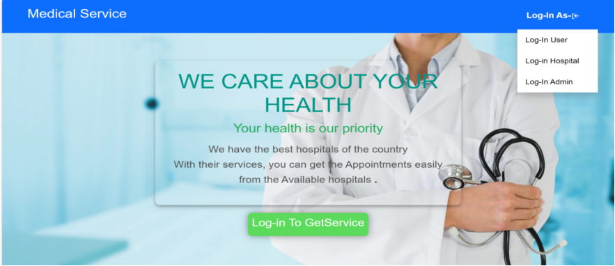
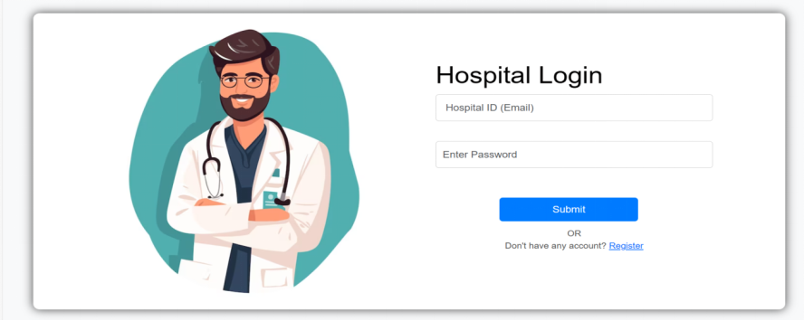

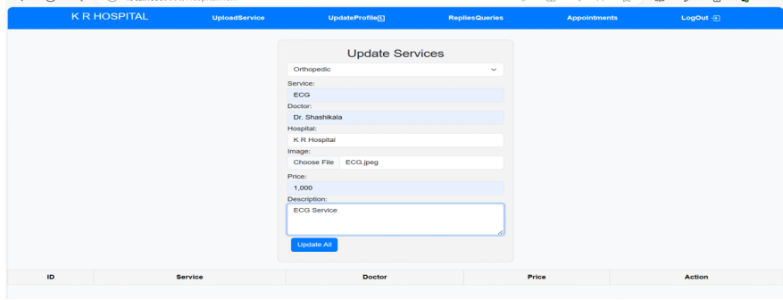
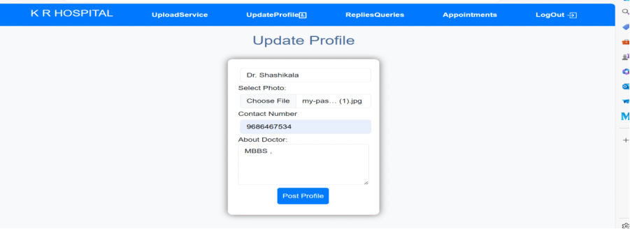

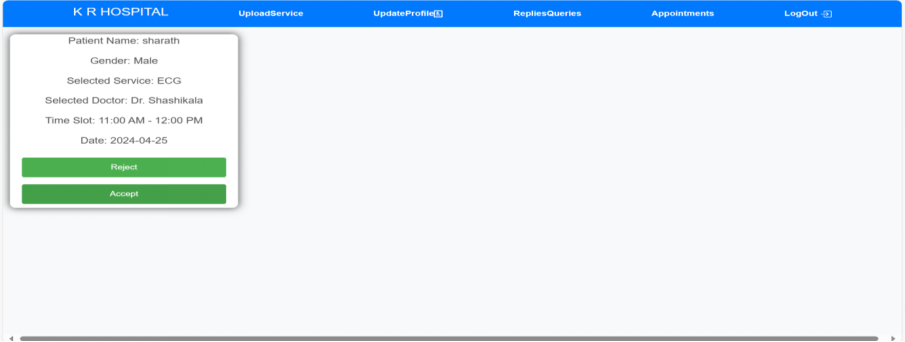
User Page

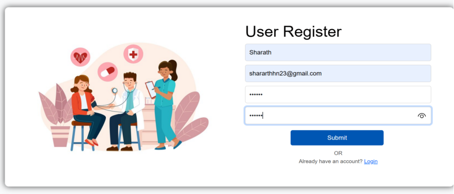

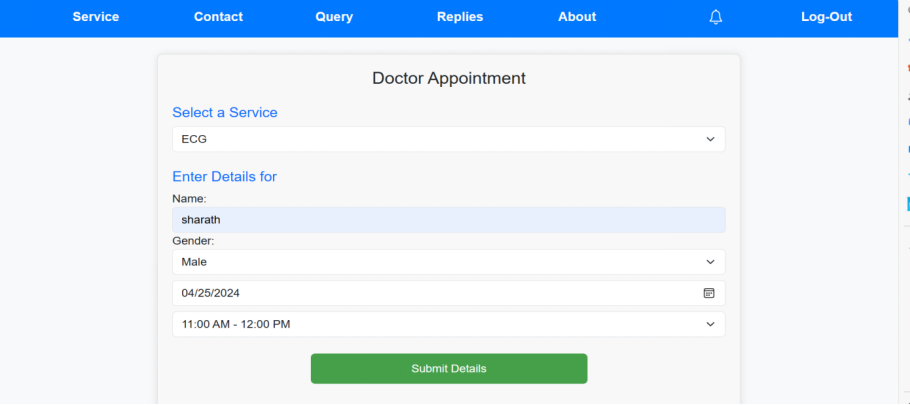
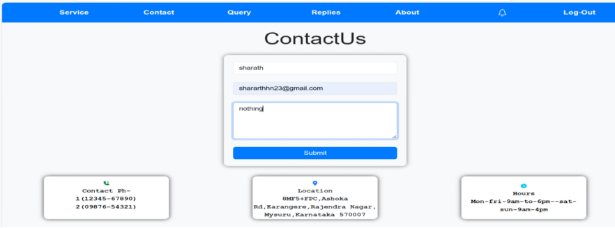
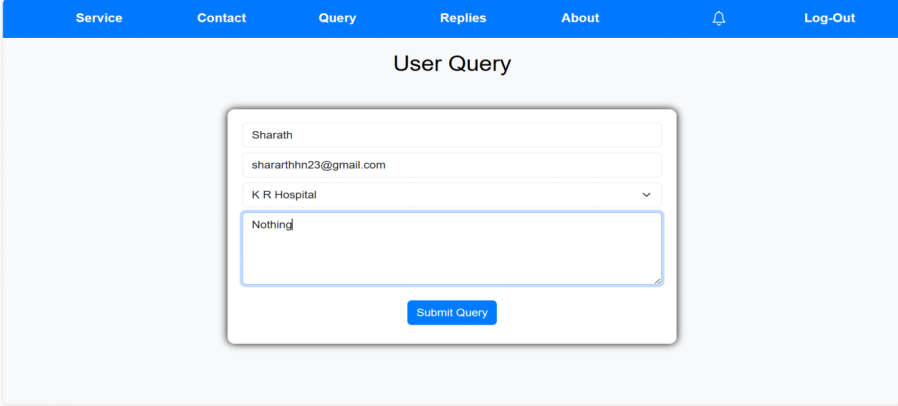
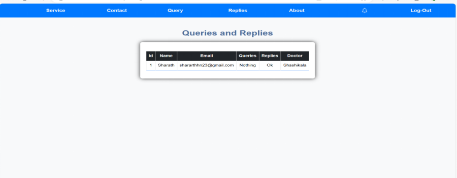

Admin Page

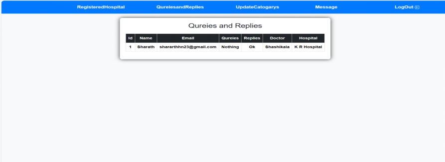

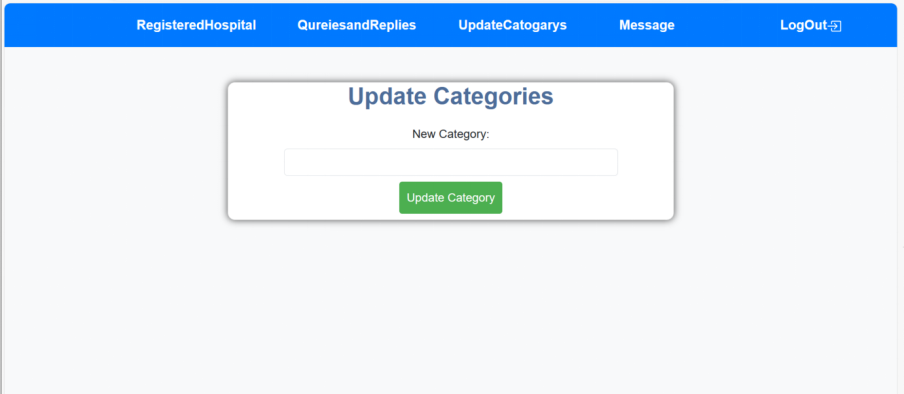
---

## 🔗 Repository Information
- GitHub Repo: [Medical Service FSD Project](https://github.com/sharath-6363/Medical-service-FSD-project.git)  
- Author: **Sharath (sharath-6363)**  

---
